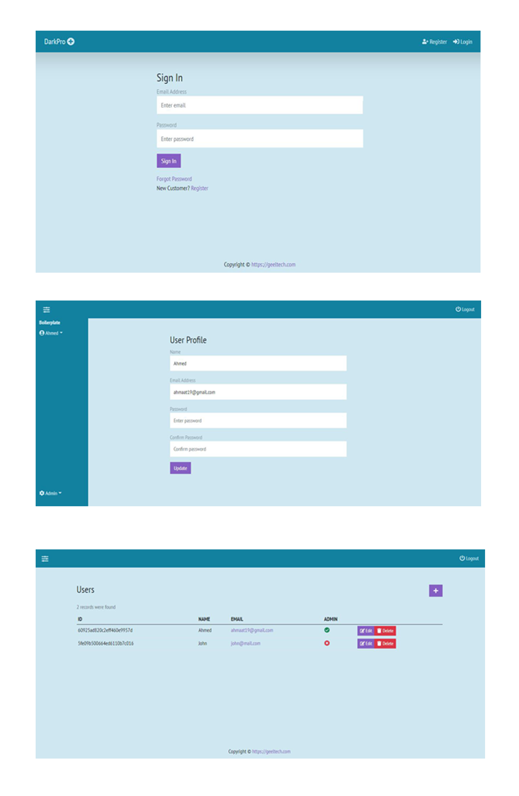

# Complete MERN-Stack Boilerplate



## Features

- Login
- Signup
- Forgot Password
- Reset Password with Email
- Welcome Page
- Profile Page
- Admin Page
- Users Management
- Users Group Management
- Users Route Management based on groups
- User Logs With React Query RealTime
- Pagination

## Tech

I used number of different technologies

- Node.js
- Express
- Nodemailer
- MongoDB
- ReactJS
- Moment.js
- React Query
- axios
- react-confirm-alert
- Bootstrap v5
- React-Hook-Form
- Zoho Mail
- react-icons
- docker
- and so on

## Installation

This MERN Boilerplate requires these technologies to run:

- [Node.js](https://nodejs.org/) v12+
- [MongoDB](https://mongodb.com/) ether local MongoDB or MongoDB Atlas

```sh
cd MERN-Stack-Boilerplate
cd frontend && npm install
cd ../backend && npm install
npm run dev
```

To run inside a docker use:-

```sh
cd MERN-Stack-Boilerplate
docker-compose -f docker-compose.prod.yml up --build -d
```

## To insert default seed data

copy and paste the below URL to your browser URL bar.

```
http://localhost:4000/api/users/insert/seeds
```

### Default admin authentication is:

- Email: _ahmaat19@gmail.com_
- Password: _123456_

**_Free MERN Boilerplate, Hell Yeah!_**
