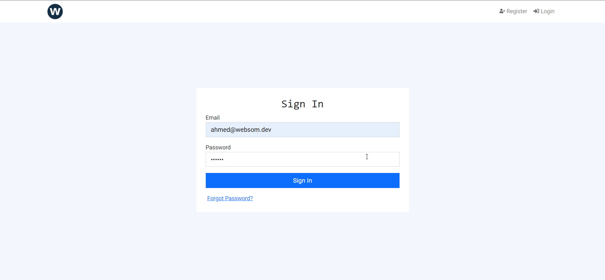

# Complete MERN-Stack Boilerplate



## Features

- Login
- Signup
- Forgot Password
- Reset Password with Email
- Users Management
- Permissions Management
- Roles Management
- Users Role Management based on roles and permission\
- User Profile
- All Users Profile Page
- Welcome Page
- Pagination
- Search

## Tech

I used number of different technologies

- Nodemailer
- MongoDB
- React.js
- Moment.js
- React Query
- axios
- react-confirm-alert
- Bootstrap v5
- React-Hook-Form
- Yandex Mail
- react-icons
- and so on

## Installation

This NEXT.js boilerplate requires these technologies to run:

- [Node.js](https://nodejs.org/) v12+
- [MongoDB](https://mongodb.com/) ether local MongoDB or MongoDB Atlas

```sh
cd MERN-Stack-Boilerplate
cd frontend && npm install
cd ../backend && npm install
npm run dev
```

### To insert default seed data

Copy and paste the below url/route into your browser url bar.

```sh
http://localhost:5000/api/auth/seed?secret=js
```

Your can find the default `super admin` and `password` in the below directory

```sh
/backend/src/config/data.js
```

### Default super admin authentication is:

- Email: _ahmed@websom.dev_
- Password: _123456_

**_Free NEXT.js Boilerplate, Hell Yeah!_**
